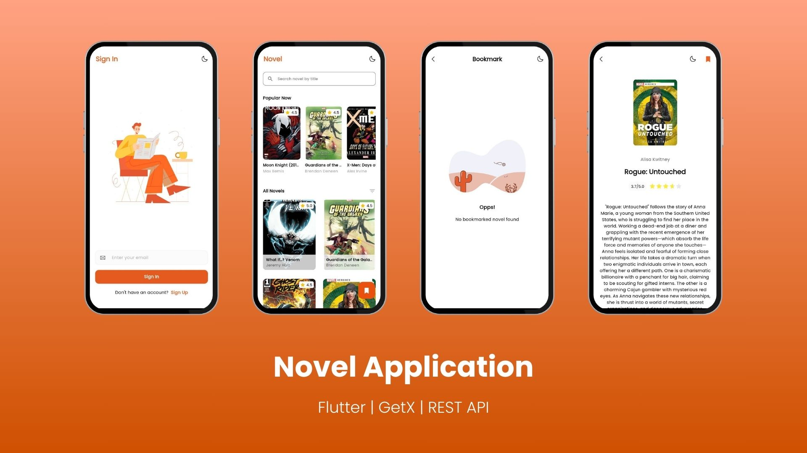

## Novel

 

## Welcome to Novel 📖

Mobile application develop with Flutter, Getx and REST API.

## System Requirements 💻

| Type | Details             |
| ---- | ------------------- |
| 1.   | Flutter SDK         |
| 2.   | Git                 |
| 3.   | IDE (e.g., VS Code) |

For my development, i am using Flutter SDK v3.22.2.

## Set Up Project 👇

1. Clone the repository.
2. CD to the directory: `cd novel-app`.
3. Paste the `.env` file to project root folder.
4. Run `flutter pub get`.

## App Features 🔥

Features implemented:

- **Authentication**: Sign in, Sign up with OTP verification.
- **Home Page**: Displays list of novels fetched from the API, Can also serach novel by the title.
- **Details Page**: Shows detailed information about specific novel.
- **Bookmark Page**: Shows bookmarked novel list.
- **Error Handling**: Displays proper error message for API or network issues.
- **Offline Support**: Fetched data from API saved to local using the `get_storage`.
- **List Refresh**: Pull-to-refresh to refresh novel list.

## Technical Requirements ⚙️

- **API Integration**: Use `http` package for API requests.
- **State Management**: Use the `GetX` package.
- **Navigation**: Implement navigation with named routes using `GetX`.
- **Responsive Design**: Use the `sizer` package for responsive design.
"# novel-app" 
